<p align="center">
  <picture>
    <source media="(prefers-color-scheme: dark)" srcset="docs/readme/banner-dark.svg">
    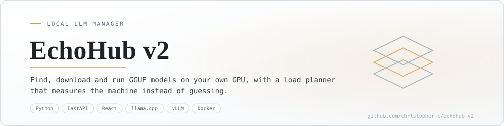
  </picture>
</p>

<p align="center"><sub>English · <a href="#version-française">Version française</a></sub></p>

# EchoHub v2

A manager for language models that run on your own GPU: find a model, download it, load it with settings that fit *this* machine, talk to it, and hand it tools that do real things. Nothing leaves the box.

> Status: in daily use. Docker image with CUDA 12.8, llama.cpp and vLLM engines, 442 Python tests, and every screenshot below comes from the running app. Last active August 2026.

<p align="center">
  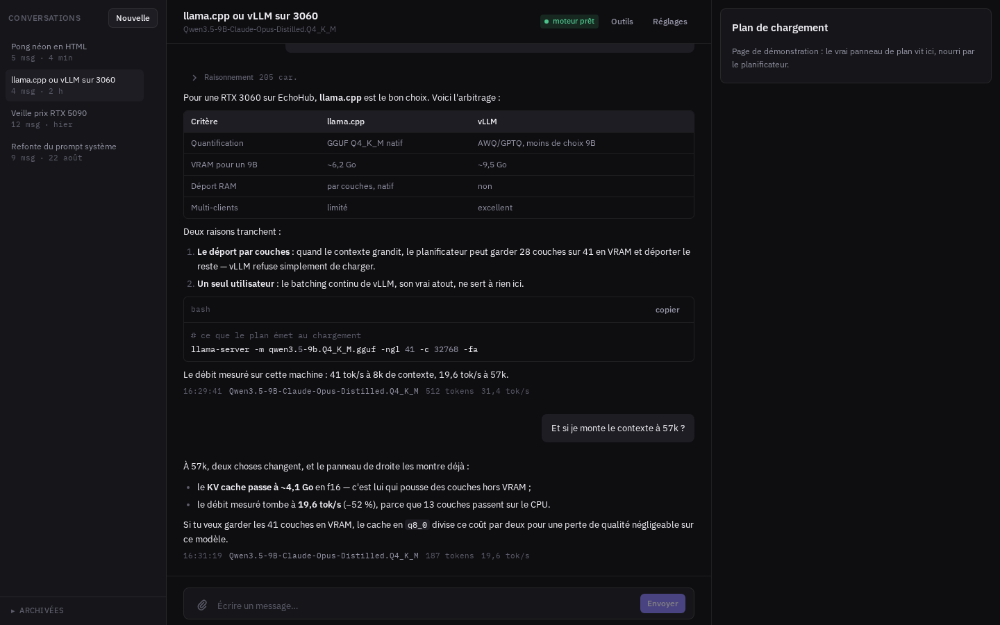
</p>
<p align="center"><sub>A conversation: streaming answer, context gauge, and the load plan the model is actually running under.</sub></p>

## Why a v2

The first EchoHub guessed. It read the number of layers from the file name, assumed 150 MB per layer, and raised the context size after every failed load until the GPU gave up. On a Qwen3.6-35B-A3B the guess was 80 layers at 150 MB; the file says 41 layers at 436 MB. Six bugs of that family in one afternoon convinced me the orchestration layer was wrong by construction, not buggy.

So the v2 has one load planner, and it measures instead of assuming.

<p align="center">
  <picture>
    <source media="(prefers-color-scheme: dark)" srcset="docs/readme/planner-dark.svg">
    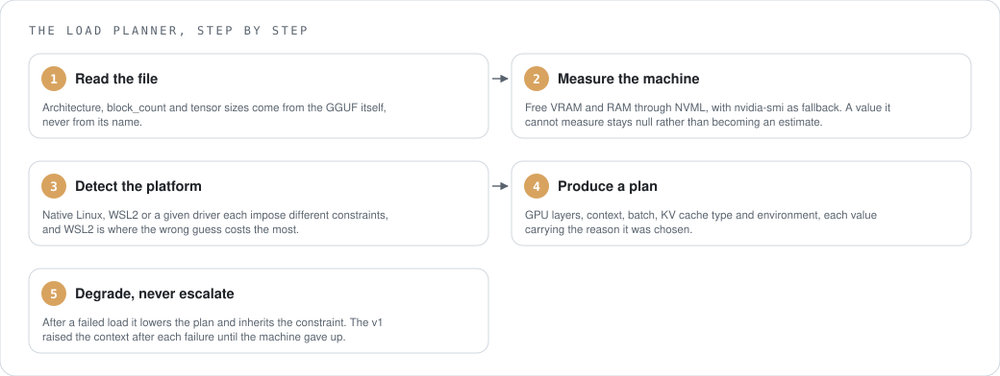
  </picture>
</p>

The planner is a pure function: it receives the metadata and the memory budget, and returns a plan. It touches neither the disk nor NVML itself, which is exactly what makes it testable without a GPU. The frontend displays that plan and never recomputes it.

## What it does

- Searches Hugging Face, downloads with resume and multi-part files, keeps a local registry and a disk inventory, and gives a VRAM verdict before you commit.
- Reads the GPU through NVML with `nvidia-smi` as fallback. A value it cannot measure stays `null` rather than becoming an estimate.
- Runs llama.cpp through its native `llama-server`, or vLLM in its own versioned venv, one model at a time under a supervisor.
- Keeps conversations in SQLite with branches and non-destructive edits, streams over SSE, shows how full the context is, and compacts old turns automatically at 90 %.
- Gives the model eleven tools (web search, fetch a page, read, write and edit files, search in files, run Python, run a command, present a file, create an artefact), enabled per conversation, each with its token cost measured by the loaded model's own tokenizer.
- Runs that code in a separate persistent container where the agent can install what it needs.
- Searches the web through a local SearXNG that is never published outside the stack.
- Works on a phone: drawers, an adapted composer, a models screen that fits.

<table>
<tr>
<td width="50%">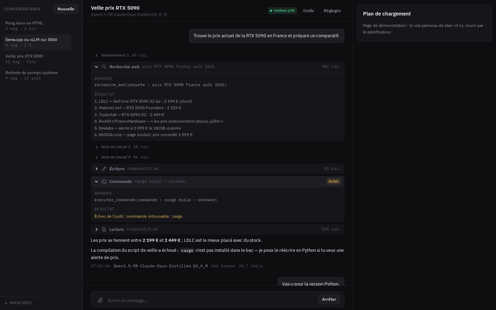</td>
<td width="50%">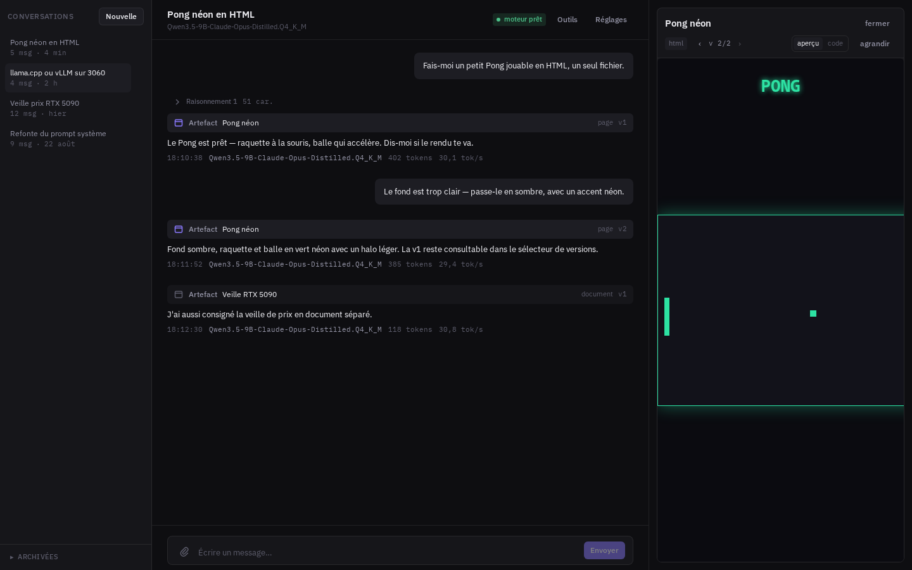</td>
</tr>
<tr>
<td><sub>Tools are chosen per conversation, and each one shows what its definition costs in tokens.</sub></td>
<td><sub>An artefact the model produced, rendered in place, with its code one click away.</sub></td>
</tr>
</table>

## How it works

<p align="center">
  <picture>
    <source media="(prefers-color-scheme: dark)" srcset="docs/readme/how-it-works-dark.svg">
    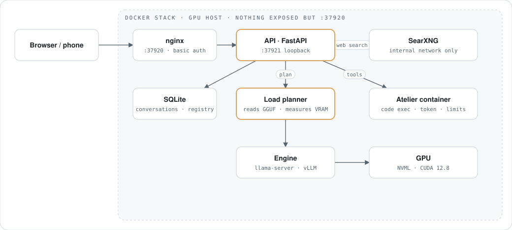
  </picture>
</p>

nginx serves the frontend and proxies `/api` to FastAPI, which owns the registry, the conversations and the tools. The engine process is started with the plan the planner produced. SearXNG and the execution workshop sit on the internal network with no published port; the backend reaches the workshop over HTTP with a shared token.

## Install

<p align="center">
  <picture>
    <source media="(prefers-color-scheme: dark)" srcset="docs/readme/install-dark.svg">
    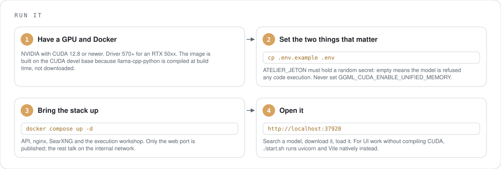
  </picture>
</p>

```sh
cp .env.example .env        # put a random secret in ATELIER_JETON
docker compose up -d        # GPU image + SearXNG + workshop
```

The interface is on `http://localhost:37920`. For working on the UI without compiling CUDA:

```sh
./start.sh                  # uvicorn + Vite with hot reload, logs emptied at each start
./stop.sh
```

## Use

<p align="center">
  <picture>
    <source media="(prefers-color-scheme: dark)" srcset="docs/readme/usage-dark.svg">
    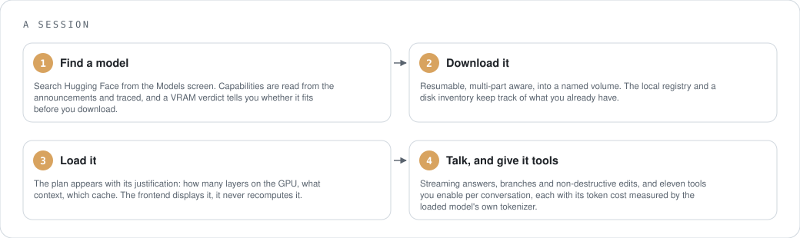
  </picture>
</p>

<p align="center">
  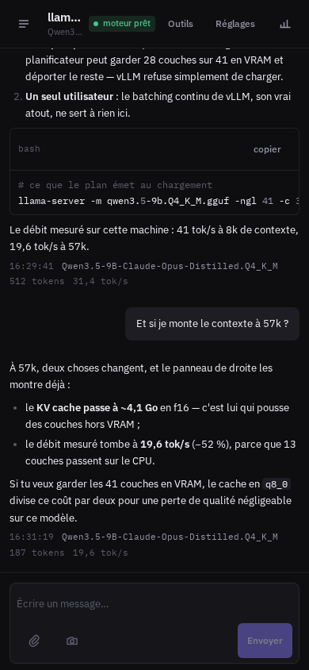
  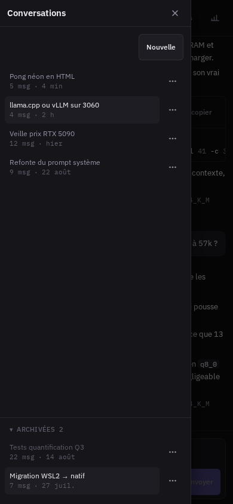
  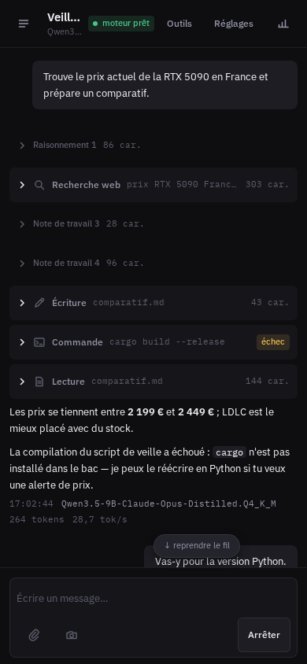
  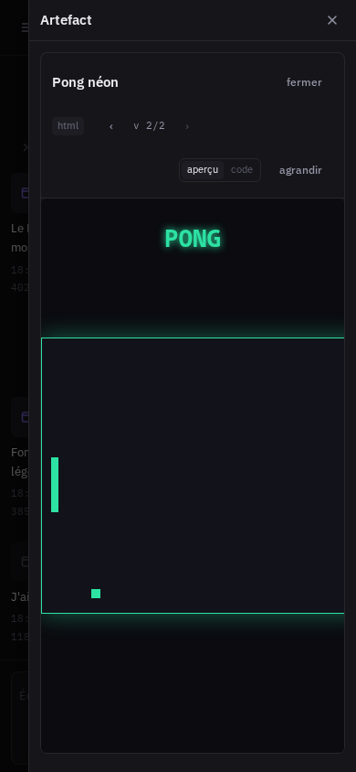
</p>

## Where things live

<p align="center">
  <picture>
    <source media="(prefers-color-scheme: dark)" srcset="docs/readme/files-dark.svg">
    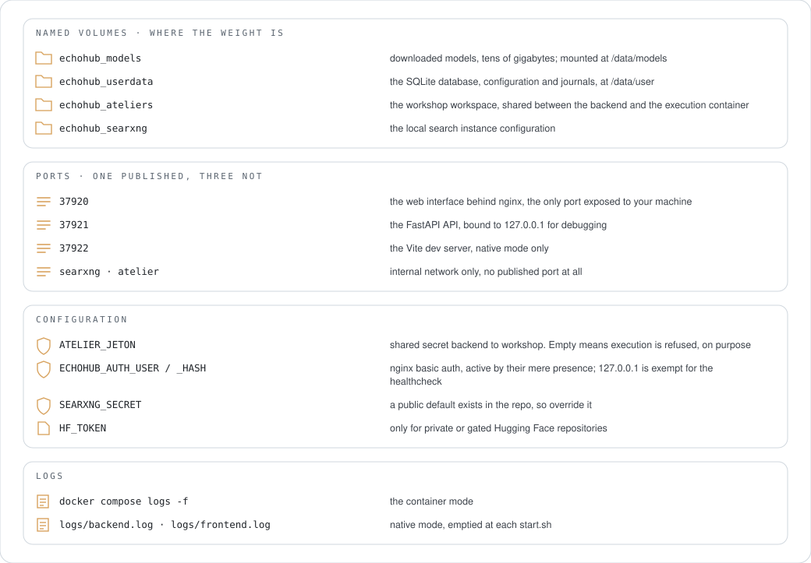
  </picture>
</p>

## Security

<p align="center">
  <picture>
    <source media="(prefers-color-scheme: dark)" srcset="docs/readme/security-dark.svg">
    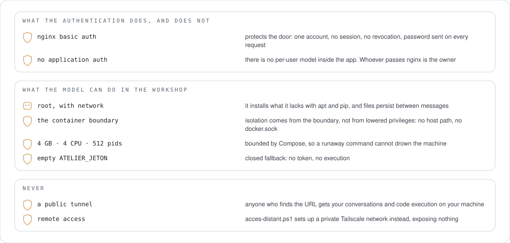
  </picture>
</p>

Read that one before showing this to anyone. The short version: the model executes real code as root inside a container with network access, and the authentication in front is a single shared password. That combination is fine on a machine you control and a network you trust, and it is a bad idea anywhere else. The workshop replaced a locked-down sandbox that protected the host by making the tool useless: measured on 26 August, `nasm: command not found` and a pip with nowhere to write.

## Uninstall

<p align="center">
  <picture>
    <source media="(prefers-color-scheme: dark)" srcset="docs/readme/uninstall-dark.svg">
    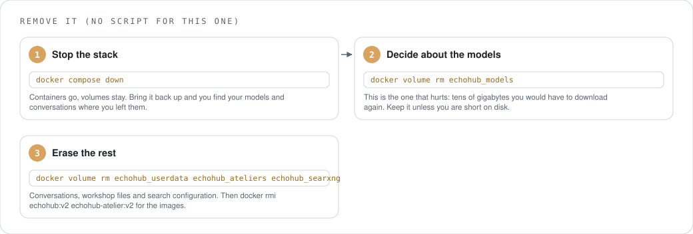
  </picture>
</p>

## Measured

<p align="center">
  <picture>
    <source media="(prefers-color-scheme: dark)" srcset="docs/readme/measured-dark.svg">
    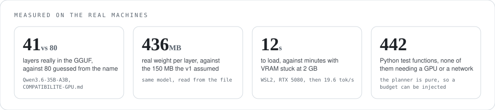
  </picture>
</p>

Throughput on the same model and the same card, with the context as the only variable: 41 tok/s at 32768, 19.6 tok/s at 57344, with 29 of 41 layers on the GPU. That gap is why the plan is shown rather than hidden.

```sh
docker run --rm --gpus all --entrypoint /app/backend/.venv/bin/python \
  -v "$PWD/backend/inference:/app/backend/inference" \
  -v "$PWD/backend/outils:/app/backend/outils" \
  echohub:v2 -m pytest backend -q
```

Mount only the subfolders you are testing: mounting all of `backend` hides the venv that lives inside it.

## What it stands on

<p align="center">
  <picture>
    <source media="(prefers-color-scheme: dark)" srcset="docs/readme/deps-dark.svg">
    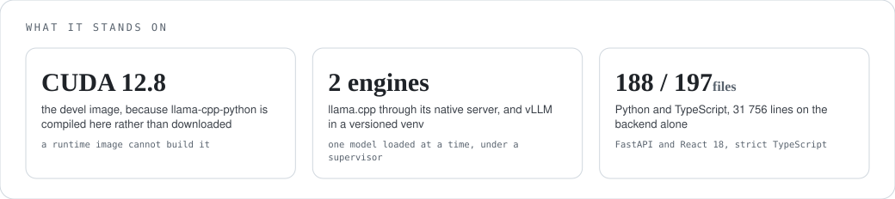
  </picture>
</p>

Python 3.10, FastAPI, uvicorn, pydantic, loguru. React 18, TypeScript strict, Tailwind, Framer Motion, Vite, Bun. Python is imposed by the engines, not chosen. Zero `any`, and `tsc` has to pass: the v1 shipped three TypeScript errors nobody ever saw, because `bun run dev` does not run `tsc`.

## Help

| Symptom | Cause | Fix |
|---|---|---|
| Loading takes minutes and VRAM sits at 2 GB (WSL2) | `GGML_CUDA_ENABLE_UNIFIED_MEMORY` is set, and ggml acts on its mere presence even when empty | remove the variable entirely; the same model then loads in 12 s |
| The tools answer "execution refused" | `ATELIER_JETON` is empty | put a random secret in `.env` and restart the stack |
| The build dies in nvcc on MMQ kernels | nvcc 12.8 segfaults on those kernels for Blackwell | the Dockerfile forces cuBLAS instead; keep that flag |
| Inference runs on the CPU after a `pip install` | the PyPI wheel of `llama-cpp-python` is CPU-only | install with `--no-binary`, or just use the image |
| vLLM and llama.cpp fight over the GPU | vLLM preallocates all the VRAM and returns it only when it stops | treat the GPU as exclusive, one engine at a time |
| Docker stops seeing the GPU after a reboot | the CDI spec pinned a device major that changes when the module reloads | regenerate the CDI spec; restarting the container is not enough |
| The GPU is not exposed on your platform | Linux with CDI and Windows with WSL2 want different Compose syntax | pick the override matching your host; the other one fails silently |

## Where it stands

Everything listed above works and I use it every day. Known debt: a handful of files past 500 lines, the largest at about 1 000, and a table-ordering bug in the database init that trips some suites on a fresh database. The UI is in French.

## Project docs

`ARCHITECTURE.md`, `STATE.md`, `TODO.md`, `COMPATIBILITE-GPU.md` (every GPU constraint here was paid for with a real failure), `DESIGN.md`, `PLAN-EXECUTION.md`, `MESURES-MOE.md`, `BENCH-QWEN38-27B.md`, `PREUVES-MULTIMODAL.md`, `ARBORESCENCE.md`.

## Licence

No licence file yet.

---

## Version française

Un gestionnaire de modèles de langage qui tournent sur ton propre GPU : trouver un modèle, le télécharger, le charger avec des réglages qui tiennent sur *cette* machine, discuter avec, et lui donner des outils qui agissent pour de vrai. Rien ne sort de la machine.

> État : en usage quotidien. Image Docker CUDA 12.8, moteurs llama.cpp et vLLM, 442 tests Python, et chaque capture ci-dessous vient de l'application en marche. Dernière activité : août 2026.

<p align="center">
  
</p>
<p align="center"><sub>Une conversation : réponse en flux, jauge de contexte, et le plan de chargement sous lequel le modèle tourne réellement.</sub></p>

### Pourquoi une v2

Le premier EchoHub devinait. Il lisait le nombre de couches dans le nom du fichier, supposait 150 Mo par couche, et augmentait la taille du contexte après chaque échec de chargement jusqu'à ce que le GPU abandonne. Sur un Qwen3.6-35B-A3B, la supposition disait 80 couches à 150 Mo ; le fichier dit 41 couches à 436 Mo. Six défauts de cette famille en un après-midi m'ont convaincu que la couche d'orchestration était fausse par construction, pas boguée.

La v2 a donc un seul planificateur de chargement, et il mesure au lieu de supposer.

<p align="center">
  <picture>
    <source media="(prefers-color-scheme: dark)" srcset="docs/readme/planner-dark.svg">
    
  </picture>
</p>

Le planificateur est une fonction pure : il reçoit les métadonnées et le budget mémoire, et rend un plan. Il ne touche ni au disque ni à NVML lui-même, ce qui est exactement ce qui le rend testable sans GPU. Le frontend affiche ce plan et ne le recalcule jamais.

### Ce que ça fait

- Cherche sur Hugging Face, télécharge avec reprise et fichiers en plusieurs parts, tient un registre local et un inventaire disque, et rend un verdict VRAM avant que tu t'engages.
- Lit le GPU par NVML avec `nvidia-smi` en repli. Une valeur qu'il ne peut pas mesurer reste `null` plutôt que de devenir une estimation.
- Fait tourner llama.cpp par son `llama-server` natif, ou vLLM dans son venv versionné, un modèle à la fois sous superviseur.
- Garde les conversations en SQLite avec branches et édition non destructive, diffuse en SSE, montre le remplissage du contexte, et compacte les vieux tours automatiquement à 90 %.
- Donne au modèle onze outils (recherche web, récupérer une page, lire, écrire et modifier des fichiers, chercher dedans, exécuter du Python, exécuter une commande, présenter un fichier, créer un artefact), activables par conversation, chacun avec son coût en tokens mesuré par le tokenizer du modèle chargé.
- Exécute ce code dans un conteneur séparé et persistant où l'agent installe ce qui lui manque.
- Cherche sur le web via un SearXNG local qui n'est jamais publié hors de la pile.
- Marche au téléphone : tiroirs, composeur adapté, écran Modèles qui tient.

<table>
<tr>
<td width="50%"></td>
<td width="50%"></td>
</tr>
<tr>
<td><sub>Les outils se choisissent par conversation, et chacun affiche ce que sa définition coûte en tokens.</sub></td>
<td><sub>Un artefact produit par le modèle, rendu en place, son code à un clic.</sub></td>
</tr>
</table>

### Comment ça marche

<p align="center">
  <picture>
    <source media="(prefers-color-scheme: dark)" srcset="docs/readme/how-it-works-dark.svg">
    
  </picture>
</p>

nginx sert le frontend et relaie `/api` vers FastAPI, qui possède le registre, les conversations et les outils. Le processus moteur est lancé avec le plan produit par le planificateur. SearXNG et l'atelier d'exécution vivent sur le réseau interne sans port publié ; le backend parle à l'atelier en HTTP avec un jeton partagé.

### Installation

<p align="center">
  <picture>
    <source media="(prefers-color-scheme: dark)" srcset="docs/readme/install-dark.svg">
    
  </picture>
</p>

```sh
cp .env.example .env        # mets un secret aléatoire dans ATELIER_JETON
docker compose up -d        # image GPU + SearXNG + atelier
```

L'interface est sur `http://localhost:37920`. Pour travailler l'interface sans compiler CUDA :

```sh
./start.sh                  # uvicorn + Vite en rechargement à chaud, journaux vidés à chaque démarrage
./stop.sh
```

### Utilisation

<p align="center">
  <picture>
    <source media="(prefers-color-scheme: dark)" srcset="docs/readme/usage-dark.svg">
    
  </picture>
</p>

<p align="center">
  
  
  
  
</p>

### Où sont les choses

<p align="center">
  <picture>
    <source media="(prefers-color-scheme: dark)" srcset="docs/readme/files-dark.svg">
    
  </picture>
</p>

### Sécurité

<p align="center">
  <picture>
    <source media="(prefers-color-scheme: dark)" srcset="docs/readme/security-dark.svg">
    
  </picture>
</p>

À lire avant de montrer ça à qui que ce soit. En bref : le modèle exécute du vrai code en root dans un conteneur avec le réseau, et l'authentification devant est un unique mot de passe partagé. Cette combinaison va très bien sur une machine que tu contrôles et un réseau de confiance, et c'est une mauvaise idée partout ailleurs. L'atelier a remplacé un bac confiné qui protégeait l'hôte en rendant l'outil inerte : mesuré le 26 août, `nasm: command not found` et un pip sans droit d'écriture.

### Désinstallation

<p align="center">
  <picture>
    <source media="(prefers-color-scheme: dark)" srcset="docs/readme/uninstall-dark.svg">
    
  </picture>
</p>

### Mesuré

<p align="center">
  <picture>
    <source media="(prefers-color-scheme: dark)" srcset="docs/readme/measured-dark.svg">
    
  </picture>
</p>

Débit sur le même modèle et la même carte, le contexte étant la seule variable : 41 tok/s à 32768, 19,6 tok/s à 57344, avec 29 couches sur 41 sur le GPU. Cet écart est la raison pour laquelle le plan est montré plutôt que caché.

```sh
docker run --rm --gpus all --entrypoint /app/backend/.venv/bin/python \
  -v "$PWD/backend/inference:/app/backend/inference" \
  -v "$PWD/backend/outils:/app/backend/outils" \
  echohub:v2 -m pytest backend -q
```

Ne monte que les sous-dossiers que tu testes : monter tout `backend` masque le venv qui vit dedans.

### Sur quoi ça repose

<p align="center">
  <picture>
    <source media="(prefers-color-scheme: dark)" srcset="docs/readme/deps-dark.svg">
    
  </picture>
</p>

Python 3.10, FastAPI, uvicorn, pydantic, loguru. React 18, TypeScript strict, Tailwind, Framer Motion, Vite, Bun. Python est imposé par les moteurs, pas choisi. Zéro `any`, et `tsc` doit passer : la v1 embarquait trois erreurs TypeScript que personne n'avait jamais vues, parce que `bun run dev` n'exécute pas `tsc`.

### Aide

| Symptôme | Cause | Remède |
|---|---|---|
| Le chargement prend des minutes et la VRAM reste à 2 Go (WSL2) | `GGML_CUDA_ENABLE_UNIFIED_MEMORY` est posée, et ggml agit sur sa seule présence même vide | retire complètement la variable ; le même modèle charge alors en 12 s |
| Les outils répondent « exécution refusée » | `ATELIER_JETON` est vide | mets un secret aléatoire dans `.env` et redémarre la pile |
| La compilation meurt dans nvcc sur les kernels MMQ | nvcc 12.8 segfault sur ces kernels pour Blackwell | le Dockerfile force cuBLAS à la place ; garde ce réglage |
| L'inférence tourne sur le CPU après un `pip install` | la wheel PyPI de `llama-cpp-python` est CPU seule | installe avec `--no-binary`, ou utilise simplement l'image |
| vLLM et llama.cpp se disputent le GPU | vLLM préalloue toute la VRAM et ne la rend qu'à l'arrêt | traite le GPU comme exclusif, un moteur à la fois |
| Docker ne voit plus le GPU après un redémarrage | le spec CDI a figé un major de périphérique qui change au rechargement du module | régénère le spec CDI ; redémarrer le conteneur ne suffit pas |
| Le GPU n'est pas exposé sur ta plateforme | Linux avec CDI et Windows avec WSL2 veulent des syntaxes Compose différentes | prends la surcharge qui correspond à ton hôte ; l'autre échoue en silence |

### Où ça en est

Tout ce qui est listé plus haut fonctionne et je m'en sers tous les jours. Dette connue : quelques fichiers au-delà de 500 lignes, le plus gros vers 1 000, et un bug d'ordre dans l'initialisation de la base qui fait trébucher certaines suites sur une base neuve.

### Documentation du projet

`ARCHITECTURE.md`, `STATE.md`, `TODO.md`, `COMPATIBILITE-GPU.md` (chaque contrainte GPU qui y est écrite a été payée par une panne réelle), `DESIGN.md`, `PLAN-EXECUTION.md`, `MESURES-MOE.md`, `BENCH-QWEN38-27B.md`, `PREUVES-MULTIMODAL.md`, `ARBORESCENCE.md`.

### Licence

Pas encore de fichier de licence.
