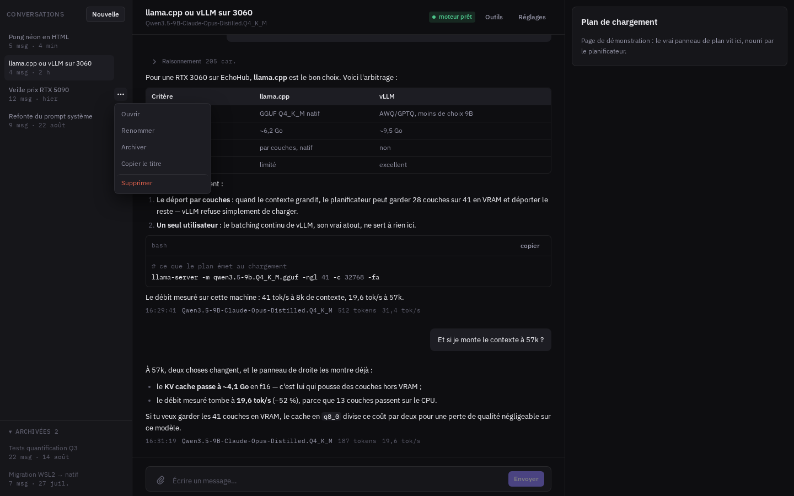

# EchoHub v2

Gestionnaire de modèles de langage locaux : trouver un modèle, le télécharger, **décider comment le
charger sur la machine réelle**, dialoguer avec, et lui donner des outils qui agissent pour de vrai.



La v2 est une reprise complète d'EchoHub, motivée par un constat mesuré sur la version précédente :
la couche qui décide **comment** charger un modèle était fausse par construction.

| Défaut de la v1 | Réalité mesurée |
|---|---|
| Couches déduites du nom de fichier par paliers | 80 estimées, **41** réelles |
| Poids par couche supposé à 150 Mo | **436 Mo** réels |
| Trois estimations concurrentes (frontend, router, service) | aucune ne lit le fichier |
| `GGML_CUDA_ENABLE_UNIFIED_MEMORY` posé sans détecter la plateforme | sous WSL2 : modèle en RAM, VRAM inutilisée |
| Paramètres **augmentés** après chaque échec de chargement | 55k → 131k de contexte, jusqu'au mur |
| `config.json` d'un modèle pris pour argent comptant | tour de vision déclarée, poids absents |

Aucun n'est un bug isolé : ce sont les symptômes d'une couche d'orchestration qui **devine** ce
qu'elle pourrait **lire**.

## Le principe

Un planificateur de chargement unique, qui mesure au lieu de supposer :

1. lire les métadonnées réelles du GGUF (architecture, `block_count`, taille des tenseurs) ;
2. mesurer la VRAM et la RAM réellement libres ;
3. détecter la plateforme (WSL2, Linux natif, pilote) et ses contraintes ;
4. produire un plan complet — couches GPU, contexte, batch, type de cache KV, variables
   d'environnement — **avec la justification de chaque valeur** ;
5. **dégrader** après un échec, jamais escalader.

Source unique de vérité : le frontend affiche le plan, il ne le recalcule jamais.

## Ce que l'application fait aujourd'hui

- **Modèles** — recherche Hugging Face, capacités déduites des annonces et tracées, téléchargement
  avec reprise et parts multiples, registre local, inventaire disque, verdict de faisabilité VRAM.
- **Matériel** — GPU par NVML (repli `nvidia-smi`), mémoire, contraintes de plateforme. Une valeur
  non mesurable vaut `null`, jamais une estimation.
- **Moteurs** — llama.cpp servi par son binaire natif `llama-server`, et vLLM (venvs versionnés,
  installation suivie en SSE). Un seul modèle chargé à la fois, sous superviseur.
- **Conversations** — branches et édition non destructive, streaming SSE, persistance SQLite,
  panneau d'occupation du contexte, compaction de l'historique avant comptage.
- **Outils du modèle** — 11 outils : `recherche_web`, `recuperer_page`, `ecrire_fichier`,
  `lire_fichier`, `modifier_fichier`, `lister_fichiers`, `chercher_dans_fichiers`,
  `executer_python`, `executer_commande`, `presenter_fichier`, `creer_artefact`. Sélectionnables par
  conversation, avec leur coût en tokens mesuré par le tokenizer du modèle chargé.
- **Atelier** — l'exécution de code et de commandes vit dans un conteneur de dev séparé et
  persistant (voir plus bas).
- **Recherche web** — instance SearXNG locale, jamais publiée.

L'interface est utilisable au téléphone (tiroirs, composeur, écran Modèles adaptés).

## Lancement

Prérequis : Docker avec accès GPU NVIDIA (CUDA 12.8+), ou un environnement Python 3.10 + Bun pour le
mode natif.

```bash
cp .env.example .env       # ajuster les ports et ATELIER_JETON
docker compose up -d       # image GPU complète + SearXNG + atelier
```

Développement, sans compilation CUDA :

```bash
./start.sh                 # uvicorn + serveur Vite, rechargement à chaud
./start.sh --docker        # équivalent de docker compose up
./stop.sh [--docker]
./restart.sh [--docker]
```

Le mode natif ne compile pas `llama-cpp-python` pour CUDA — c'est le rôle de l'image Docker. Il sert
au développement de l'interface et de la logique, pas à mesurer le GPU.

### Ports

| Service | Port | Variable |
|---|---|---|
| Interface web (nginx) | 37920 | `ECHOHUB_PORT_WEB` |
| API FastAPI (débogage, lié à `127.0.0.1`) | 37921 | `ECHOHUB_PORT_API` |
| Serveur de dev Vite (mode natif) | 37922 | `ECHOHUB_PORT_FRONT_DEV` |

Volontairement distincts de ceux de la v1 (37820/37821/37822) : les deux versions peuvent tourner en
même temps sans se disputer un port. SearXNG et l'atelier ne publient **aucun** port — ils ne sont
joignables que sur le réseau interne de la pile.

### Variables d'environnement

Toutes dans `.env.example`. Les non évidentes :

| Variable | Rôle |
|---|---|
| `ATELIER_JETON` | Jeton partagé backend ↔ atelier. **Vide = exécution refusée** (repli fermé) |
| `HF_TOKEN` | Seulement pour les dépôts Hugging Face privés ou sous licence acceptée |
| `ECHOHUB_AUTH_USER` / `ECHOHUB_AUTH_HASH` | Authentification HTTP nginx, activée par leur seule présence. Les engendrer avec `docker compose exec echohub /app/backend/.venv/bin/python docker/outils-acces.py` |
| `SEARXNG_SECRET` | Clé de l'instance de recherche. Un défaut public existe : le surcharger |

`GGML_CUDA_ENABLE_UNIFIED_MEMORY` n'a délibérément aucune ligne active : sous WSL2, ggml l'active
sur la simple présence de la variable, même vide, et laisse le modèle en RAM avec la VRAM figée à
2 Go (mesuré : plusieurs minutes de chargement contre 12 s sans elle).

## L'atelier d'exécution

Les outils `executer_python` et `executer_commande` n'exécutent rien dans le backend. L'exécution
vit dans un conteneur de dev séparé et persistant, `echohub-atelier`, où l'agent est **root** avec
réseau, PATH complet et toolchain : il installe ce qui lui manque (`apt`, `pip`), et fichiers comme
paquets persistent d'un message à l'autre.

L'isolation vient de la frontière du conteneur, pas de privilèges abaissés : aucun chemin de l'hôte
monté, **aucun `docker.sock`**, ressources bornées par Compose (`mem_limit`, `cpus`, `pids_limit`),
aucun port publié. Le backend lui parle par HTTP interne, gardé par `ATELIER_JETON`.

Ce choix remplace un bac confiné (`setuid` + `rlimits` + PATH minimal) qui protégeait l'hôte au prix
de rendre l'outil inerte : mesuré le 2026-08-26, `nasm: command not found` et un pip sans droit
d'écriture. Détails dans `ARCHITECTURE.md`.

## Sécurité — à lire avant toute exposition

- **Aucune authentification applicative.** Celle de nginx protège l'accès, pas les données : un seul
  compte, sans session ni révocation, mot de passe envoyé à chaque requête.
- **Le modèle exécute du code réel** dans l'atelier, en root, avec le réseau. Quiconque atteint
  l'interface atteint cette capacité.
- Pour un accès distant, `acces-distant.ps1` monte un réseau privé Tailscale — rien n'est exposé sur
  Internet. Un tunnel public donnerait à quiconque trouve l'URL les conversations et l'exécution de
  code sur la machine.

## Stack

Python 3.10, FastAPI, uvicorn, pydantic, loguru · React 18, TypeScript strict, Tailwind,
Framer Motion, Vite, Bun · Docker, nginx (statique + proxy `/api`), CUDA 12.8 devel.

Python est imposé par `llama-cpp-python` et vLLM, pas choisi. Zéro `any`, `tsc` doit passer : la v1
avait trois erreurs TypeScript jamais vues parce que `bun run dev` n'exécute pas `tsc`.

## Tests

442 fonctions de test Python, sans GPU ni réseau — le planificateur est testable par injection de
métadonnées et de budget mémoire, ce qui était impossible en v1. Quatre suites TypeScript pures
(analyse Markdown, extraction du raisonnement, lecture d'appel d'outil, versions d'artefact) tournent
sous `bun run <fichier>.test.ts`.

```bash
# Suite Python, sans toucher au conteneur en service (le venv vit dans backend/.venv :
# monter tout backend l'écraserait)
docker run --rm --gpus all --entrypoint /app/backend/.venv/bin/python \
  -v "$PWD/backend/inference:/app/backend/inference" \
  -v "$PWD/backend/outils:/app/backend/outils" \
  echohub:v2 -m pytest backend -q
```

## Documentation

| Fichier | Contenu |
|---|---|
| `ARCHITECTURE.md` | Carte des domaines, règles de frontière, définition de chaque dossier |
| `ARBORESCENCE.md` | Arbre complet, une ligne par fichier |
| `STATE.md` | État courant, décisions et leurs raisons, contexte non évident |
| `TODO.md` | Ce qui reste, par priorité |
| `COMPATIBILITE-GPU.md` | Contraintes GPU payées en pannes réelles — CUDA, WSL2, débits mesurés |
| `DESIGN.md` | Langage visuel : palette sémantique, typographie, mouvement |
| `MESURES-MOE.md` · `BENCH-QWEN38-27B.md` | Relevés sur les modèles à experts et bancs d'essai |
| `PREUVES-MULTIMODAL.md` | Coût en tokens d'une image, et repli sans tour de vision |
| `PLAN-EXECUTION.md` | Plan des lots, sections référencées depuis le code |

## Coexistence avec la v1

Ports distincts par défaut, et répertoire de données distinct : sans `XDG_DATA_HOME` explicite, la
v2 range ses données sous `<racine>/echohub-v2/` (la v1 utilise `<racine>/echohub/`). Les deux
versions peuvent partager le même `XDG_DATA_HOME` hôte sans lire ni écrire la même base SQLite —
leurs schémas sont incompatibles (`created_at` en v1, `cree_le` en v2).
